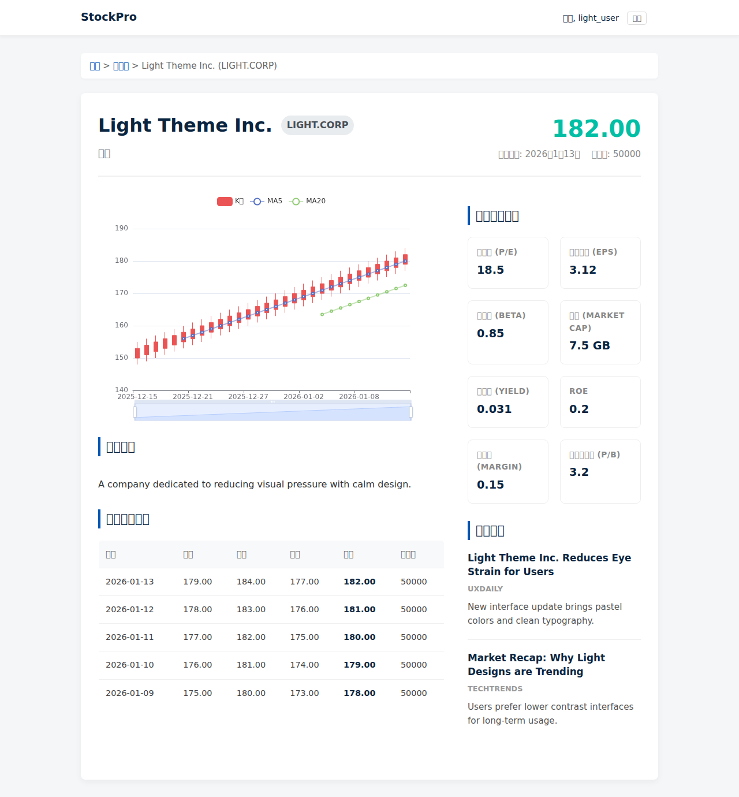

# 股票分析平台 MVP

這是一個基於 Django 開發的股票分析平台最小可行性產品 (MVP)，旨在提供舒適、清晰的股票追蹤體驗。

## 功能特色 (Features)

*   **輕量化設計 (Light Theme)**: 採用「Light/Relaxed」風格，減少視覺壓力，提供清晰的閱讀體驗。
*   **即時資訊 (Live Info)**: 整合 Yahoo Finance 獲取即時新聞與基本面數據 (P/E, EPS, Yield 等)。
*   **互動式圖表**: 使用 [ECharts](https://echarts.apache.org/) 繪製 K 線圖，並包含 MA5, MA20 技術指標。
*   **最近交易活動**: 詳細頁面展示最近 5 日的股價走勢與交易量。
*   **使用者系統**: 支援使用者註冊、登入、登出及 Email 驗證。
*   **股票追蹤清單**: 使用者可以新增或移除股票到自己的追蹤清單。
*   **背景任務**: 使用 `django-background-tasks` 定期更新股價資料。

## 預覽 (Preview)

### 介面設計 (Light Theme UI)



> 您也可以直接查看 `docs/verify_light_theme.html` 檔案以檢查 HTML 結構與樣式。

## 技術棧 (Tech Stack)

*   **後端**: Django 5.x, Python 3.11
*   **資料庫**: PostgreSQL / SQLite
*   **前端**: HTML5, CSS3 (Light Theme Variables), ECharts
*   **部署**: 支援 Docker Compose 及標準 PaaS (Heroku/Render) 一鍵部署 (One-Click Deploy)。

## 部署指南 (Deployment)

### 選項 A: One-Click Deploy (PaaS)

本專案已配置 `Procfile` 與 `runtime.txt`，支援 Heroku、Render、Railway 等平台的一鍵部署。

1. **Push to Repo**: 將程式碼推送到您的 Git Repository。
2. **Connect Service**: 在 PaaS 平台上連結此 Repo。
3. **Environment Variables**: 設定必要的環境變數 (建議)：
   * `SECRET_KEY`: 您的加密金鑰
   * `DEBUG`: `False` (生產環境)
   * `DATABASE_URL`: 若平台未自動提供，請設定資料庫連線字串。
4. **Deploy**: 平台將自動偵測並部署 Web (Gunicorn) 與 Worker (Background Tasks)。

### 選項 B: Docker Compose

```bash
# 啟動服務 (Web, DB, Worker)
docker compose up --build

# 初始化資料庫 (首次啟動)
docker compose exec web python manage.py migrate

# 訪問網站
http://127.0.0.1:8000/
```

### 選項 C: 本地開發 (Local Development)

```bash
# 安裝依賴
pip install -r requirements.txt

# 初始化資料庫
python manage.py migrate

# 啟動 Web Server
python manage.py runserver

# 啟動 Background Worker (另開終端機)
python manage.py process_tasks
```
