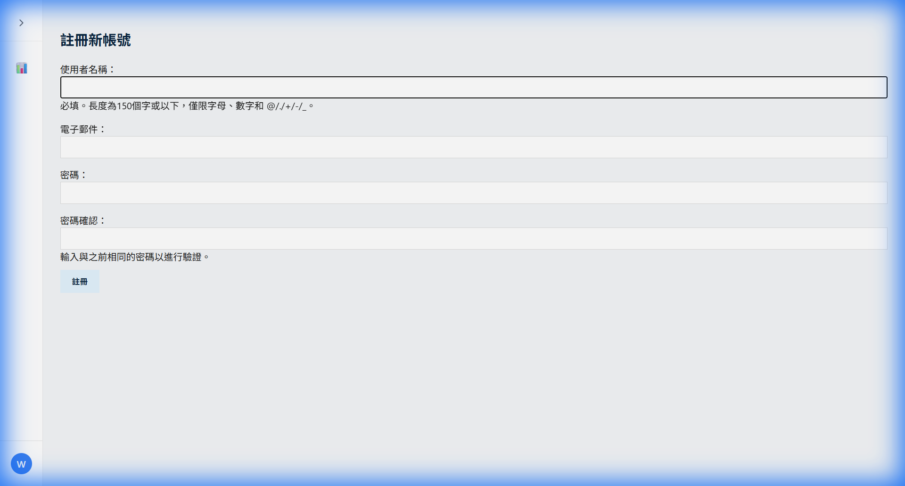
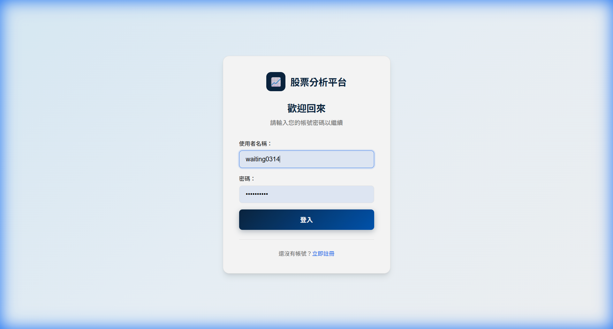
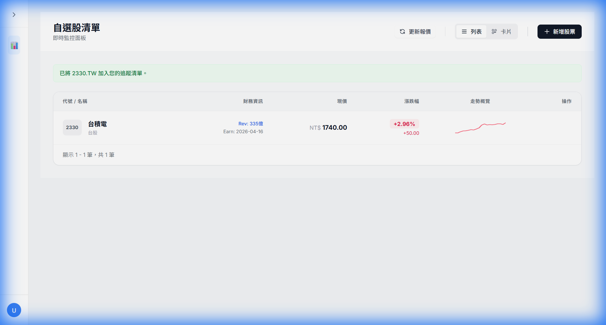
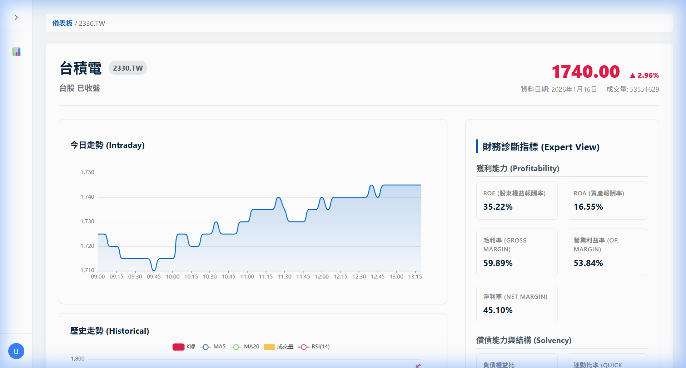

# 股票分析平台 MVP

這是一個基於 Django 開發的股票分析平台最小可行性產品 (MVP)，旨在提供舒適、清晰的股票追蹤體驗。

## 功能特色 (Features)

*   **輕量化設計 (Light Theme)**: 採用「Light/Relaxed」風格，減少視覺壓力，提供清晰的閱讀體驗。
*   **即時資訊 (Live Info)**: 整合 Yahoo Finance 獲取即時新聞與基本面數據 (P/E, EPS, Yield 等)。
*   **互動式圖表**: 使用 [ECharts](https://echarts.apache.org/) 繪製 K 線圖，並包含 MA5, MA20 技術指標。
*   **最近交易活動**: 詳細頁面展示最近 5 日的股價走勢與交易量。
*   **使用者系統**: 支援使用者註冊、登入、登出及 Email 驗證。
*   **股票追蹤清單**: 使用者可以新增或移除股票到自己的追蹤清單。
*   **背景任務**: 使用 `django-background-tasks` 定期更新股價資料。
*   **多幣值支援**: 台股自動顯示 NT$、美股顯示 $。

## 快速上手 (Quick Start)

部署完成後，請按照以下步驟開始使用：

### 1️⃣ 註冊帳號
訪問註冊頁面 `http://localhost:8088/users/signup/` 建立新帳號。



### 2️⃣ 登入系統
使用剛才建立的帳號登入。



### 3️⃣ 新增股票到自選股
1. 登入後會看到「自選股清單」頁面
2. 點擊右上角的 **「+ 新增股票」** 按鈕
3. 選擇市場（台股/美股）
4. 輸入股票代號（例如：`2330` 或 `AAPL`）
5. 點擊「加入自選股」

> **小提示**: 台股代號格式為 `2330`（系統會自動加上 `.TW`），美股直接輸入如 `AAPL`。

### 4️⃣ 查看儀表板 (Dashboard)
儀表板會顯示您追蹤的所有股票，可切換「列表」或「卡片」檢視模式。



### 5️⃣ 查看股票詳情 (Detail)
點擊任一股票可進入詳細頁面，查看 K 線圖、財務指標及相關新聞。



> **特色功能**: K 線圖、技術指標 (RSI, MA)、財務診斷指標 (ROE, ROA, 毛利率等) 及即時新聞。

## 技術棧 (Tech Stack)

*   **後端**: Django 5.x, Python 3.11
*   **資料庫**: PostgreSQL / SQLite
*   **前端**: HTML5, CSS3 (Light Theme Variables), ECharts
*   **部署**: 支援 Docker Compose 及標準 PaaS (Heroku/Render) 一鍵部署 (One-Click Deploy)。

## 部署指南 (Deployment)

### 選項 A: One-Click Deploy (PaaS)

本專案已配置 `Procfile` 與 `runtime.txt`，支援 Heroku、Render、Railway 等平台的一鍵部署。

1. **Push to Repo**: 將程式碼推送到您的 Git Repository。
2. **Connect Service**: 在 PaaS 平台上連結此 Repo。
3. **Environment Variables**: 設定必要的環境變數 (建議)：
   * `SECRET_KEY`: 您的加密金鑰
   * `DEBUG`: `False` (生產環境)
   * `DATABASE_URL`: 若平台未自動提供，請設定資料庫連線字串。
4. **Deploy**: 平台將自動偵測並部署 Web (Gunicorn) 與 Worker (Background Tasks)。

### 選項 B: Docker Compose（一鍵部署 🚀）

```bash
# 1. 複製環境變數範例檔（可選，預設值可直接使用）
cp .env.example .env

# 2. 啟動所有服務（自動執行資料庫遷移）
docker compose up -d

# 3. 訪問網站
# http://localhost:8088/
```

> **說明**: 首次啟動時，系統會自動建立資料庫並執行遷移，無需手動操作。

#### 其他 Docker 常用指令

```bash
# 查看服務狀態
docker compose ps

# 查看 Worker 日誌
docker compose logs -f worker

# 停止服務
docker compose down

# 停止服務並清除資料
docker compose down -v
```


### 選項 C: 本地開發 (Local Development)

```bash
# 安裝依賴
pip install -r requirements.txt

# 初始化資料庫
python manage.py migrate

# 啟動 Web Server
python manage.py runserver

# 啟動 Background Worker (另開終端機)
python manage.py process_tasks
```
